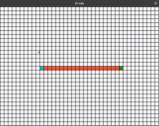
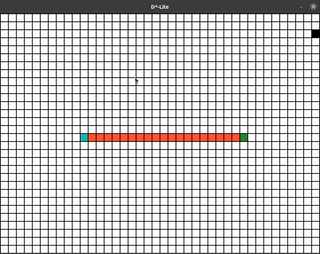

# D* Lite
This repository contains a C++ implementation of __D* Lite__ algorithm. 
__D* Lite__ is an incremental heuristic search algorithm developed by _Sven Koenig_ in his paper: [D* Lite](http://idm-lab.org/bib/abstracts/papers/aaai02b.pdf).  

Being an incremental search algorithm, it speeds up search for dynamic environments by reusing the planning results of previous policies. Thus, outperforming repeated A* searches.

Below is an illustration of the real-time updates to the policy.




> * White squares are free cells.
> * Black squares are obstacles.
> * Cyan square is the start cell.
> * Green square is the goal cell.
> * Orange squares are the optimal path to the goal.

## Dependencies
* [CMake](https://cmake.org/install/) >= 3.7
* GCC/G++
* [SFML](https://www.sfml-dev.org/tutorials/2.5/#getting-started) >= 2.5

## Installation Instructions (Ubuntu)
1. Clone the repo.
2. Make sure all dependencies are installed:
    ```bash
    sudo apt install build-essential cmake libsfml-dev
    ```
3. Open a terminal in the repo directory.
4. Make a build directory in the top level directory: 
    ```bash
    mkdir build && cd build
    ```
5. Compile:
    ```bash
    cmake .. && make
    ```
6. Run:
    ```bash
    ./DStarLiteVisualization
    ```

## Controls
* _Left Click_: add obstacle
* _Right Click_: remove obstacle
* _Key "__R__"_: remove all obstacles
